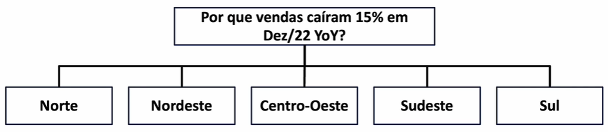
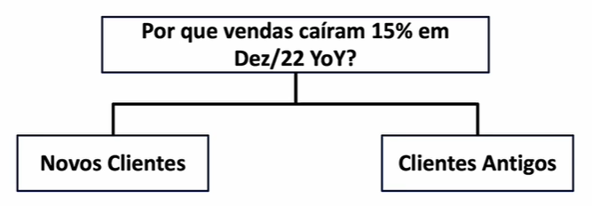
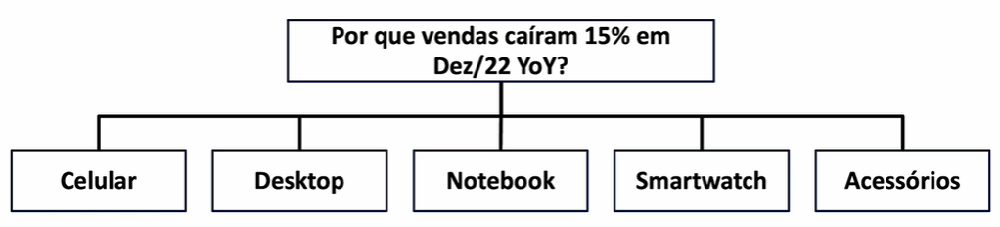

# 🧱 Estruturar a análise
- Pensar e montar estratégias para "atacar" o problema
- Para isso, dividir o problema em partes menores

-> Dividir por setores, segmentos, fatores internos e externos...

## Técnica de segmentação
Identificar a causa raiz da queda de 15%, segmentando o problema em várias partes

Alguma dessas segregações explica o problema ou é uma queda generalizada?

- Regiões:

- Clientes:

- Produtos:

Se nenhuma segregação explicar o problema, será necessário partir para outros métodos (teste/validação)
