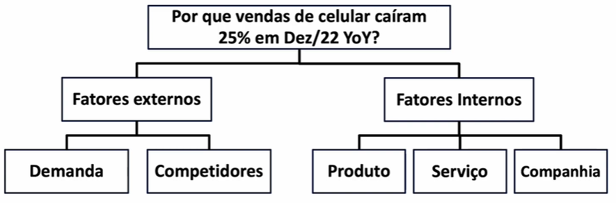

# 🧺🧹 Coleta e tratamento de dados
- Extração direta via banco de dados (SQL)
- Extração de um dashboard de um BI
- Envio via planilha

#### Tabela original:

| Ano | Mês | Categoria   | Receita     |
|-----|-----|-------------|-------------|
| 2021| 12  | Celular     | 18.924.267  |
| 2021| 12  | Desktop     | 4.731.067   |
| 2021| 12  | Notebook    | 3.154.045   |
| 2021| 12  | Smartwatch  | 2.523.236   |
| 2021| 12  | Acessórios  | 2.207.831   |
| 2022| 12  | Celular     | 14.146.501  |
| 2022| 12  | Desktop     | 4.800.909   |
| 2022| 12  | Notebook    | 3.300.988   |
| 2022| 12  | Smartwatch  | 2.560.000   |
| 2022| 12  | Acessórios  | 2.000.980   |

#### Tabela dinâmica:

| Categoria  | 2021       | 2022       | Var% | Delta |
|------------|------------|------------|------|-------|
| Celular    | 18.924.267 | 14.146.501 | -25% | -4.8M |
| Desktop    | 4.731.067  | 4.800.909  |  1%  |  0.1M |
| Notebook   | 3.154.045  | 3.300.988  |  5%  |  0.1M |
| Smartwatch | 2.523.236  | 2.560.000  |  1%  |  0.0M |
| Acessórios | 2.207.831  | 2.000.980  |  -9% | -0.2M |

# 🔍 Análise de dados
- Podemos observar que o problema da diminuição se encontra em Celular e Acessórios (Var%), com Celular tendo um maior impacto na receita final (Delta)

- Mas, porque isso acontece? Podemos voltar para a etapa de estruturação para refinar as hipóteses

Exemplo: A causa raiz do problema está nos competidores! Eles fizeram parcerias com fintechs para venda de celulares por um menor preço

