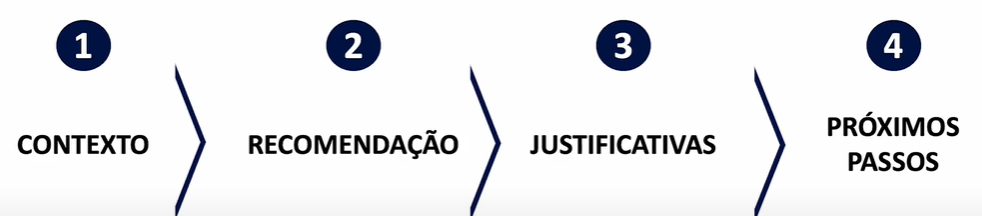

# ✅ Plano de ação
### Avaliar a parceria com Fintechs 
- Estudar os modelos de parceria que concorrentes estão realizando
- Elaborar Business Case para avaliação de oportunidades
- Caso aprovado, levantar possíveis alvos para parcerias (Ex. qual o tipo de contrato?)
- Negociar e fechar parceria, caso vantajoso

### Expandir para parcerias com outras empresas
- Avaliar setores com sinergia (clientes)
- Elaborar Business Case para avaliação de oportunidades
- Caso aprovado, levantar possíveis alvos para parcerias (Ex. qual o tipo de contrato?)
- Negociar e fechar parceria, caso vantajoso

#### Importante mapear riscos

# 🧑‍🏫 Apresentação de resultados

### Apresentação Top-Down
- Primeiro apresenta a mensagem principal (problema),propostas e solução e, por fim, os argumentos de suporte
